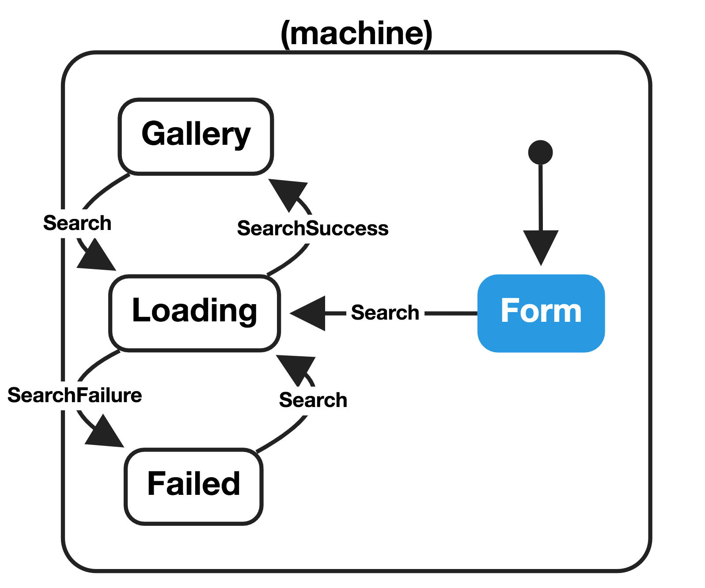

# Strongly-typed finite-state machines with Redux and TypeScript

At the core of state machines is the following function:

```
(state, action) => newState
```

If you're familiar with [Redux](https://redux.js.org/), that might look familiar to you. Redux is a state machine! A Redux [reducer](https://redux.js.org/basics/reducers) function describes how the machine should [_transition_](https://statecharts.github.io/glossary/transition.html), given the previous state and an [action](https://redux.js.org/basics/actions) (aka an [event](https://statecharts.github.io/glossary/event.html) in [statechart] terminology), to the next state.

This article is interested in how we can utilise Redux to write a strongly-typed _finite_-state machine, in the interests of code correctness and readability. By _finite_, we mean that the machine may only be in one of a finite number of states at any given time. By strongly-typed, we mean that the states and actions should carry the types of their parameters, and these parameters should only be accessible when we've narrowed the union of states or actions to a single variant.

The examples in this article are [available on GitHub](https://github.com/unsplash/ts-redux-finite-state-machine-example).

## Setting the scene

Throughout this article we will use the example of a simple photo gallery. The application starts in a _form_ state, where the user may enter a query. Upon form submission the _search_ event is triggered, and the application should transition into a _loading_ state. When request either fails or succeeds, corresponding events _search failure_ and _search success_ are triggered the application should transition into the _failure_ or _succeed_ states, respectively. We can represent this as a [statechart] diagram:



Generated via https://musing-rosalind-2ce8e7.netlify.com/?machine=%7B%22initial%22%3A%22form%22%2C%22states%22%3A%7B%22form%22%3A%7B%22on%22%3A%7B%22SEARCH%22%3A%22loading%22%7D%7D%2C%22loading%22%3A%7B%22on%22%3A%7B%22SEARCH_SUCCESS%22%3A%7B%22gallery%22%3A%7B%7D%7D%2C%22SEARCH_FAILURE%22%3A%22error%22%7D%7D%2C%22error%22%3A%7B%22on%22%3A%7B%22SEARCH%22%3A%22loading%22%7D%7D%2C%22gallery%22%3A%7B%22on%22%3A%7B%22SEARCH%22%3A%22loading%22%7D%7D%7D%7D

## Intro

To begin we must define some basic types and helpers which we'll need to use later on:

```ts
// types.ts
export type GalleryItem = { id: string };
```

We'll also need a helper for defining our `State` and `Action` types, which are known as [tagged union] types.

```ts
// typescript-helpers.ts
interface TaggedVariant<T extends string, P> {
    type: T;
    payload: P;
}

export const createTaggedVariant = <T extends string, P>(
    type: T,
    payload: P,
): TaggedVariant<T, P> => ({
    type,
    payload,
});
```

## Defining states

```ts
// states.ts
import { GalleryItem } from './types';
import { createTaggedVariant } from './typescript-helpers';

export enum StateType {
    Form = 'Form',
    Loading = 'Loading',
    Failure = 'Failure',
    Gallery = 'Gallery',
}

export const form = () => createTaggedVariant(StateType.Form, {});
type Form = ReturnType<typeof form>;

export const loading = ({ query }: { query: string }) =>
    createTaggedVariant(StateType.Loading, {
        query,
    });
type Loading = ReturnType<typeof loading>;

export const failure = () => createTaggedVariant(StateType.Failure, {});
type Failure = ReturnType<typeof failure>;

export const gallery = ({ items }: { items: GalleryItem[] }) =>
    createTaggedVariant(StateType.Gallery, {
        items,
    });
type Gallery = ReturnType<typeof gallery>;

export type State = Form | Loading | Failure | Gallery;
```

## Defining actions

```ts
// actions.ts
import { GalleryItem } from './types';
import { createTaggedVariant } from './typescript-helpers';

export enum ActionType {
    Search = 'Search',
    SearchFailure = 'SearchFailure',
    SearchSuccess = 'SearchSuccess',
}

export const search = ({ query }: { query: string }) =>
    createTaggedVariant(ActionType.Search, {
        query,
    });
type Search = ReturnType<typeof search>;

export const searchFailure = () =>
    createTaggedVariant(ActionType.SearchFailure, {});
type SearchFailure = ReturnType<typeof searchFailure>;

export const searchSuccess = ({ items }: { items: GalleryItem[] }) =>
    createTaggedVariant(ActionType.SearchSuccess, {
        items,
    });
type SearchSuccess = ReturnType<typeof searchSuccess>;

export type Action = Search | SearchFailure | SearchSuccess;
```

## Defining transitions

Earlier we saw how Redux's reducer functions allow us to describe our state transitions. We can define which transitions are valid for given states—for example, we don't want to honour the _search failure_ event when we're in a _gallery_ state—as well how the transition should be performed.

```ts
import { Reducer } from 'redux';

import { Action, ActionType } from './actions';
import * as states from './states';

const initialState: states.State = states.form();

export const reducer: Reducer<states.State, Action> = (
    state = initialState,
    action,
) => {
    switch (state.type) {
        // For each state, we match each valid event and perform the corresponding state transition.
        case states.StateType.Form:
        case states.StateType.Failure:
        case states.StateType.Gallery:
            switch (action.type) {
                case ActionType.Search:
                    return states.loading({ query: action.payload.query });
                default:
                    return state;
            }
        case states.StateType.Loading: {
            switch (action.type) {
                case ActionType.SearchFailure:
                    return states.failure();
                case ActionType.SearchSuccess:
                    return states.gallery({ items: action.payload.items });
                default:
                    return state;
            }
        }
    }
};
```

## Tying it all together

To demonstrate our state machine, we can simulate actions. In a real world application, these would be driven by outside events such as user interactions or HTTP responses.

```ts
// index.ts
import * as actions from './actions';
import { configureAndCreateStore } from './store';

const example = () => {
    const store = configureAndCreateStore();

    console.log('Initial state', store.getState());

    store.dispatch(actions.search({ query: 'dogs' }));

    setTimeout(() => {
        store.dispatch(
            actions.searchSuccess({
                items: [{ id: 'english-setter' }, { id: 'irish-setter' }],
            }),
        );

        setTimeout(() => {
            store.dispatch(actions.search({ query: 'cats' }));

            setTimeout(() => {
                store.dispatch(actions.searchFailure());
            }, 1000);
        }, 1000);
    }, 1000);
};

example();
```

This log shows the initial state and, for each transition, the action and next state.

```
Initial state { type: 'Form', payload: {} }
{ action: { type: 'Search', payload: { query: 'dogs' } },
  nextState: { type: 'Search', payload: { query: 'dogs' } } }
{ action: { type: 'SearchSuccess', payload: { items: [Array] } },
  nextState: { type: 'SearchSuccess', payload: { items: [Array] } } }
{ action: { type: 'Search', payload: { query: 'cats' } },
  nextState: { type: 'Search', payload: { query: 'cats' } } }
{ action: { type: 'SearchFailure', payload: {} },
  nextState: { type: 'SearchFailure', payload: {} } }
```

## Going further

There is much more to state machines than this example demonstrates. However, the simple primitive of a reducer allows for all types of state machines. For example, ["nested state machines"](https://en.wikipedia.org/wiki/UML_state_machine#Hierarchically_nested_states) can simply be modelled as nested reducers. Likewise, ["parallel state machines"](https://statecharts.github.io/glossary/parallel-state.html) are just [combined reducers](https://redux.js.org/recipes/structuringreducers/usingcombinereducers).

Our `Action` and `State` types are known as [tagged union] types. There are much cleaner ways of defining and using tagged union types in TypeScript, but I refrained from using them in this example for simplicity. At Unsplash we tend to use [unionize](https://github.com/pelotom/unionize). For example, here is how we might define the `Action` tagged union type if we were to use unionize:

```ts
// actions.ts
import { ofType, unionize, UnionOf } from 'unionize';

import { GalleryItem } from './types';

export type SearchAction = { query: string };

export const Action = unionize(
    {
        Search: ofType<SearchAction>(),
        SearchFailure: ofType<{}>(),
        SearchSuccess: ofType<{ items: GalleryItem[] }>(),
    },
    // Tag must be `type` to conform to expected Redux action type.
    { tag: 'type' },
);
export type Action = UnionOf<typeof Action>;
```

A full example using unionize can be seen at https://github.com/unsplash/ts-redux-finite-state-machine-example/tree/unionize.

[tagged union]: https://en.wikipedia.org/wiki/Tagged_union
[statechart]: https://statecharts.github.io/
